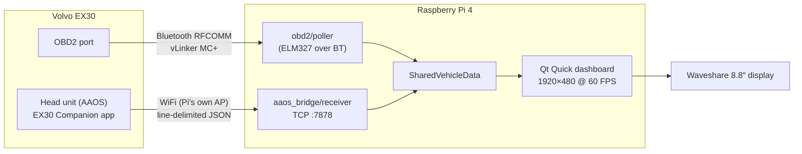

# EX30 Driver Display

A DIY driver display for the **Volvo EX30** — the one instrument the car
doesn't have. A Raspberry Pi drives an ultra-wide 8.8″ panel behind the
steering wheel, rendering speed, battery, power/regen, and trip data at
60 FPS from two live sources: the car's OBD2 port and an Android
Automotive companion app running on the head unit itself.


## Why

The EX30 moved everything — including the speedometer — to the center
touchscreen. This project puts a glanceable, driver-oriented display back
where your eyes expect it, without touching a single vehicle system:
everything is **read-only**, powered from an ignition-switched 12 V
accessory circuit, and invisible to the car.

## Project scope

What the project set out to do, and where each item landed:

| Scope item | Status |
|---|---|
| Speed, matching the car's own speedometer exactly | ✅ live (AAOS `PERF_VEHICLE_SPEED_DISPLAY`; AAOS-only — blanks to `–` if the cabin link drops) |
| Battery SoC + range | ✅ live (AAOS; an OBD2 SoC DID is confirmed but not polled — see the source table below) |
| Live power / regen gauge (kW) | ✅ live (AAOS battery power; OBD2 HV V×I fallback) |
| Brake-pressure gauge | ✅ live (OBD2, 4-channel multi-DID read) |
| HV battery temperature | ✅ live (OBD2 BECM) |
| Gear (PRND), parking brake, ignition | ✅ live (AAOS) |
| Odometer, ambient temperature | ✅ live (OBD2 / AAOS) |
| Trip computer (distance, kWh, efficiency, regen, range-to-10 %) | ✅ live, persists across power cycles |
| Charging screen with live kW + charging curve | ✅ live, auto-switches on plug-in |
| Day / night theme | ✅ live (follows the car's own `NIGHT_MODE`) |
| TPMS (4 wheels) | ✅ read out successfully during research; not on-screen |
| 12 V battery voltage | ✅ confirmed (adapter `ATRV`), not currently on-screen |
| Turn signals | ⬜ open — not exposed on OBD2 gateway or granted AAOS property |
| Blind-spot (BLIS) indicators | ⬜ open — same blocker; UI exists, driven only in the demo |
| Zero battery drain when parked | ✅ standby/sleep protection on all three links (see below) |

## How it works



Two independent data paths feed one shared model:

- **AAOS companion app** ([`ex30-companion-aaos/`](ex30-companion-aaos/))
  reads 13 vehicle properties through the public `android.car` API and
  streams them over the Pi's own WiFi access point. It is the live source
  for speed, SoC, range, gear, charging state, and day/night — the values
  the head unit itself trusts.
- **OBD2** ([`ex30-companion-runner/obd2/`](ex30-companion-runner/obd2/))
  covers what AAOS can't grant: brake pressure, HV battery temperature,
  HV voltage/current, odometer — via reverse-engineered UDS DIDs on the
  Geely SEA platform ECUs.

### Who provides what

| Value on screen | Live source | If the AAOS bridge goes stale (15 s without a frame) |
|---|---|---|
| Speed | AAOS `PERF_VEHICLE_SPEED_DISPLAY` | numeral blanks to `–` — no OBD2 fallback, deliberately (see below) |
| Power / regen gauge + session energy | AAOS battery power | OBD2 takes over automatically (HV V×I, polled in the background as a hot standby) |
| SoC % | AAOS (Wh → % via pack capacity) | last value holds — a confirmed OBD2 SoC DID exists but is registered dormant, not polled |
| Range | AAOS | hidden |
| Gear, parking brake, ignition | AAOS | last value holds |
| Day / night theme | AAOS `NIGHT_MODE` | falls back to the local clock |
| Ambient temperature | AAOS | last value holds |
| Brake gauge | OBD2 (4-channel multi-DID) | unaffected — always OBD2 |
| HV battery temperature, odometer | OBD2 | unaffected — always OBD2 |
| Charging screen trigger + charge kW | AAOS charge port + battery power | last value holds |

While the bridge is fresh, the OBD2 poller suppresses its own writes for
AAOS-covered fields so the two sources never fight over the same value.
The one field with a true hot standby is the power gauge: the poller
keeps reading HV voltage × current in the background, so when the bridge
goes stale it takes over without a discontinuity. Speed has no OBD2
fallback **by design** — the dash-calibrated value exists only on the
AAOS side, and a raw wheel-speed substitute would visibly disagree with
the car's own speedometer, so the display blanks the numeral rather than
show a lookalike number.

The head unit's GPS-disciplined clock even sets the Pi's wall clock,
since the Pi has no RTC and no internet in the car.

## Repository structure

| Path | What it is |
|---|---|
| [`ex30-companion-runner/`](ex30-companion-runner/) | The Raspberry Pi app: OBD2 stack, AAOS bridge receiver, Qt Quick dashboard, Pi setup scripts |
| [`ex30-companion-aaos/`](ex30-companion-aaos/) | The Android Automotive companion app (published as a methodology reference; install via Google Play) |
| [`SETUP.md`](SETUP.md) | Full end-to-end build & install guide |
| `ex30-companion-runner/docs/` | Research & design docs (see below) |
| `ex30-companion-aaos/docs/` | AAOS property/permission research, protocol, safety invariants |

## Materials

| Part | Role | Notes |
|---|---|---|
| Raspberry Pi 4B (2 GB) | Compute | Enough for 60 FPS Qt Quick at 1920×480 |
| Waveshare 8.8″ 1920×480 IPS | Display | Ultra-wide bar panel; fits behind the wheel |
| vLinker MC+ (Bluetooth) | OBD2 adapter | Fast, reliable ELM327-compatible; has auto-sleep |
| High-endurance microSD | Storage | Survives cabin temperatures |
| Passive aluminum case | Cooling | Fanless, silent |
| 12 V→5 V step-down (3 A, USB-C) | Power | Dashcam hardwire kit on an **ignition-switched** fuse |
| FPC micro-HDMI ribbon + right-angle USB cables | Cabling | Thin enough to route behind trim |

## Demo — try it without a car

The full dashboard runs on any desktop with mock data — this is the same
UI the car gets, driven by a built-in simulator:

```bash
cd ex30-companion-runner
python3 -m venv .venv && .venv/bin/pip install -r requirements.txt
.venv/bin/python demo_modern.py               # full boot → loading → dashboard
.venv/bin/python demo_modern.py --charge      # charging screen + taper sim
.venv/bin/python demo_modern.py --night       # night theme
```

Hotkeys: number keys load drive/charging presets, `F` cycles day/night,
`A` toggles the auto-drive simulator, `B`/`N` blinkers, `L`/`R` blind
spots, `Space` skips boot. All screenshots in this README come from
`demo_modern.py --capture`.

| | |
|---|---|
|  |  |
|  |  |

## Parked-car power & sleep protection

A device that keeps the vehicle network awake can drain an EV's 12 V
battery. This project protects against that on all three links:

- **AAOS app**: detects "driver left" from ignition state (with a
  screen-off backup signal), sends a clean `goodbye`, closes the socket,
  releases its WiFi hold, and unsubscribes everything except ignition and
  charge-port state. It stays up only while charging, so the Pi can show
  the charging screen.
- **Runner**: the OBD supervisor mirrors the same policy — polling stops
  when the car locks, so the dongle sends no queries that would hold the
  vehicle network awake.
- **Dongle**: the vLinker MC+ has its own hardware auto-sleep when the
  bus goes quiet.
- **Pi power**: wired to an ignition-switched fuse, so the Pi itself
  powers down with the car.

With this stack in place, **no significant increase in 12 V battery
consumption has been observed and none is expected**. That said, every
car, dongle, and installation differs — check your 12 V behavior during
the first days. **If you ever observe abnormal drain, stop using the
setup and remove the OBD dongle.** See the disclaimer below.

## Research & methodology docs

The interesting part for most readers — how a car with no public API got
reverse-engineered into a data source:

- [`ex30-companion-runner/docs/pid_map.md`](ex30-companion-runner/docs/pid_map.md) —
  the confirmed ECU address & DID map, the decode formulas, and the
  four-pass method (BT snoop capture → replay → DID sweeps → live
  calibration drives) used to find them. Includes the negative results.
- [`ex30-companion-runner/scripts/research/`](ex30-companion-runner/scripts/research/) —
  the actual scan/calibration tools the map was built with.
- [`ex30-companion-aaos/docs/properties.md`](ex30-companion-aaos/docs/properties.md) —
  which `VehiclePropertyIds` the retail EX30 actually grants, blocks, and why.
- [`ex30-companion-aaos/docs/permissions.md`](ex30-companion-aaos/docs/permissions.md) —
  AAOS car-permission tiers and how the grants behave on the real car.
- [`ex30-companion-aaos/pi_bridge/protocol.md`](ex30-companion-aaos/pi_bridge/protocol.md) —
  the wire protocol between head unit and Pi.
- [`ex30-companion-runner/docs/aaos_bridge.md`](ex30-companion-runner/docs/aaos_bridge.md) —
  the Pi-side receiver, source arbitration, and clock sync.
- [`ex30-companion-runner/docs/modern_ui.md`](ex30-companion-runner/docs/modern_ui.md) —
  the display's design and Qt Quick implementation notes.

## Getting the AAOS app

The EX30 Companion app is distributed through **Google Play** (it must
be — AAOS head units don't allow sideloading). The current release is
**v1.0.1**, in **closed testing**.

**To join**: open an issue on this repository (or contact
[@ifmeidan](https://github.com/ifmeidan)) with the Google account email
you use in the car, and you'll be added to the testing track. You'll
then find *EX30 Companion* in Google Play **on the car's own screen**.

Closed testing is a Google Play requirement for new apps, not a
statement about stability — it needs a minimum number of testers opted
in for a continuous period before the app can be promoted. Once that's
satisfied, the app becomes **publicly available on Google Play** with no
signup, and testers keep receiving updates automatically.

**Running without the app (OBD2-only)**: the display works before you're
enrolled, but with a reduced set — brake gauge, power/regen, HV battery
temperature and odometer come from OBD2; speed shows `–` and SoC/range
stay empty, because those are AAOS-sourced (see the source table above).
In this mode start the runner with `--no-standby`: parking standby's
wake-up signal comes from the app, so without it the screen would blank
at a long stop and only return after a power cycle.

## Build your own

The complete walk-through — hardware, Raspberry Pi setup, the WiFi
bridge, and the AAOS app configuration — is in **[SETUP.md](SETUP.md)**.

## Disclaimer

This is a personal DIY project, provided **as-is, without warranty of
any kind** (see [LICENSE](LICENSE)).

- Not affiliated with, endorsed by, or supported by Volvo Cars, Geely,
  or Google. *Volvo*, the Volvo iron mark, *EX30*, and *Android* are
  trademarks of their respective owners and appear here only to describe
  compatibility.
- The system is read-only by design — it never writes to the vehicle —
  but you install it **at your own risk**. Anything you plug into an
  OBD2 port or power circuit can, in the worst case, affect the vehicle,
  its warranty, or its battery. Verify your installation, monitor your
  12 V battery at first, and stop using the setup if you observe
  abnormal behavior.
- A secondary display must never distract from driving. Mount it where
  it doesn't obstruct your view, and comply with your local laws on
  displays and devices in the driver's field of vision.

## License

[MIT](LICENSE) — © ifmeidan.
