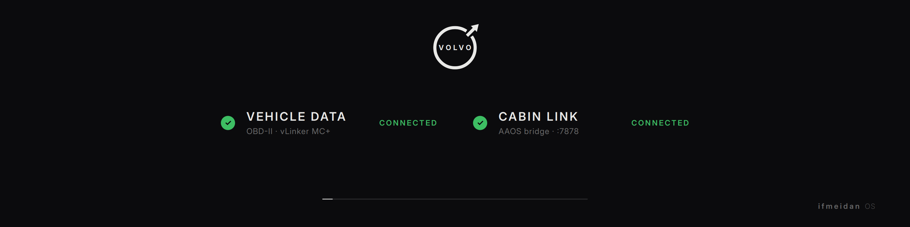
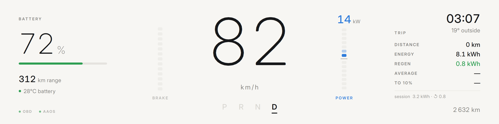
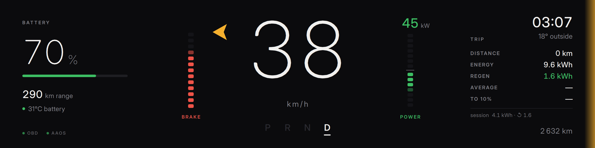
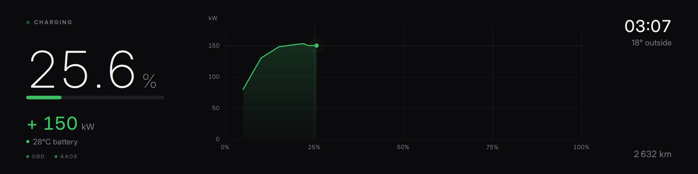

# Driver display — Qt Quick UI

The dashboard renderer: Qt Quick's GPU scene graph on the Pi's VideoCore,
fed by the same data plumbing as everything else (OBD poller + AAOS bridge
+ `SharedVehicleData`). This is the app's only dashboard UI.







## Gauges

The brake / power / throttle gauges flanking the speed are **segmented
tick bars** (stacked segments): `PedalBar.qml` fills bottom-up (13 ticks),
`PowerBar.qml` is center-zero (7 up = blue draw, 7 down = green regen).

## Startup phases

The window shows immediately and OBD connects on a background thread, so
the splash starts instantly rather than blocking on the Bluetooth link:

1. **Boot splash** (~3 s) — the 2021 iron mark: gapped ring sweeps on, the
   arrow slides through the gap, the inner VOLVO wordmark tracks into place.
   Plays while Bluetooth/ELM init happens behind it — it *hides* connection
   latency instead of adding boot time. Signed "ifmeidan OS".
2. **Loading screen** — live status for `VEHICLE DATA` (OBD-II) and
   `CABIN LINK` (AAOS bridge). Advances the moment both connect (min 1.4 s
   on screen), or after 30 s regardless (AAOS can lag); links keep retrying
   in background. Both screens carry persistent `OBD` / `AAOS` dot badges
   bottom-left — green connected, pulsing amber connecting/lost.
3. **Dashboard** — drive/charging screens auto-switch on `is_charging`,
   day/night follows AAOS `night_mode` (clock fallback).

## Values shown

Drive: speed, gear PRND, SoC % + bar, range (AAOS), battery temp, brake bar,
center-zero power bar (blue draw / green regen) with live kW, blinkers,
blind-spot edge glows, clock, ambient, odometer, charge-to-charge trip panel
(distance / energy / regen / avg / range-to-10%) + session integrals.

The **speed numeral is fed only from the dash-calibrated
`speed_display_aaos`** (see `docs/aaos_bridge.md`) — there is no fallback to
the raw wheel-speed value, so it always matches the car's own speedometer.
If the AAOS bridge goes stale, the numeral blanks to `–` instead of
freezing the last value.

Charging: SoC % (1 decimal), charge bar with flow shimmer, live charge kW,
battery temp, charging curve (kW vs SoC, sampled every 2 s),
clock/ambient/odometer.

## Architecture

```text
main.py
└── ModernDisplayApp (QQuickView, 480x1920 window)
    ├── VehicleModel (ui/modern/backend.py)
    │     30 Hz QTimer → SharedVehicleData.snapshot() → change-guarded
    │     QML properties. Owns TripTracker + charge-curve sampler.
    ├── ConnectionStatus — thread-safe store written by the OBD
    │     connector thread, polled on the same tick.
    └── qml/Main.qml — 1920x480 canvas rotated -90° (so the Waveshare
          panel's hardware 90° CW rotation yields correct landscape),
          phase machine boot → loading → dash.
```

Latency notes: data lands in QML at 30 Hz with no IPC (same process);
QML Behaviors add 110–280 ms of *smoothing* on top of raw values (pedal
bars 110 ms, speed 280 ms) — tune in `PedalBar.qml` / `SpeedCluster.qml`.
Animations run on Qt's render thread; the only CPU-painted item is the
charging curve Canvas, repainted at most every 2 s.

Fonts: vendored `ui/modern/fonts/InterVariable.ttf` (OFL). Requires
PySide6 ≥ 6.7 (already the requirements.txt floor) for variable-font
named instances.

## Demo bench (Mac, no hardware)

```bash
.venv/bin/python demo_modern.py               # full boot → loading → dash
.venv/bin/python demo_modern.py --skip-boot   # straight to dash
.venv/bin/python demo_modern.py --charge      # charging screen + taper sim
.venv/bin/python demo_modern.py --rotate      # Pi portrait format
.venv/bin/python demo_modern.py --obd-fail    # dead-adapter loading path
.venv/bin/python demo_modern.py --aaos-fail   # 8s loading timeout path
.venv/bin/python demo_modern.py --capture DIR # scripted screenshot run
```

An auto-drive simulator runs by default (toggle `A`) so animations can be
judged with continuous motion; number keys load drive/charging presets,
`F` cycles day/night force, `Space` skips boot phases. Demo trip state
persists to `state/trip_demo.json` (never touches production
`state/trip.json`).

## Pi deployment notes

- No new dependencies; the PySide6 wheel already ships QtQuick.
- `scripts/launch.sh` unchanged — Qt Quick under cage/Wayland uses GLES2
  via the existing `QT_QPA_PLATFORM=wayland`.
- If the scene ever falls back to software rendering (unlikely under
  vc4-kms-v3d), run with `QSG_INFO=1` to see the chosen backend.
